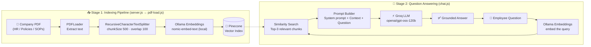

# 🧠 Enterprise RAG Assistant

> **An AI knowledge assistant that answers employee questions in seconds from company documents, so people stop searching through long policy PDFs and stop asking HR the same questions again and again.**


---

## 📌 The Business Problem

Every growing company runs into the same issue: **its knowledge is locked inside long documents.**

The HR handbook, leave policy, security rules, expense process, onboarding steps and code review checklist usually sit in a 40-section PDF or wiki that nobody reads end to end. So:

| Pain point | Business impact |
|---|---|
| 🔍 Employees spend **10–20 minutes** hunting for one policy answer | Lost productivity every day, across every team |
| 📩 HR, IT and Ops get the **same repetitive questions** ("How many sick leaves do I get?", "How do I claim internet reimbursement?") | Support teams spend their time on FAQs instead of real work |
| 🧑‍💼 New hires feel lost during onboarding | Slower ramp-up and a weaker first impression |
| ❌ People act on **outdated or half-remembered** information | Policy violations, compliance risk and wrong decisions |
| 🔐 Sensitive internal documents **can't be pasted into public chatbots** | Teams can't safely use generic AI tools |

## 💡 The Solution

**Enterprise RAG Assistant** turns a company's internal documents into a **private, conversational knowledge base**.

Employees ask questions in plain English. The assistant finds the relevant sections of the official documents and writes a clear answer **grounded only in that content**. If the answer isn't in the documents, it says **"I don't know"** instead of making something up.

```
You: How many casual leaves do I get and can they be carried forward?
Assistant: You get 12 casual leaves per year. They accumulate, up to a maximum of 24.

You: What's the internet reimbursement limit for remote work?
Assistant: Up to Rs. 1,000 per month, with a bill attached. Submit the claim on the Zoho HR
           portal within 7 days of the expense.

You: Who should I contact if my laptop is stolen?
Assistant: Report it within 1 hour to security@codersgyan.in, as per the Security Policy.
```

> The demo uses a sample internal wiki (`cg-internal-docs.pdf`) for an EdTech company. It covers HR, leave, remote work, security, expenses, onboarding, code review, access control and more.

---

## 🎯 What We Provide

| ✅ Feature | What it means for the business |
|---|---|
| **Instant answers, 24×7** | Employees get policy answers in seconds without raising a ticket |
| **Grounded responses (no hallucination)** | Answers come only from official documents, and the assistant says "I don't know" when unsure |
| **Private embeddings** | Documents are embedded **locally with Ollama**, so raw text isn't sent to a third-party embedding API |
| **Semantic search, not keyword search** | "Can I work from home?" matches the *Remote Work Guidelines* section even without the same words |
| **Plug in any document** | Swap in any PDF (HR handbook, SOPs, product docs, compliance manuals) and re-index |
| **Scalable vector storage** | Pinecone handles anything from a few pages to thousands of documents |
| **Fast LLM inference** | Groq's LPU inference keeps responses close to real time |

### 👥 Who uses it

- **Employees:** self-serve answers on leave, benefits, tools, reimbursements and policies
- **New joiners:** an onboarding buddy that knows the whole handbook
- **HR, IT and Ops teams:** fewer repetitive queries, more time for high-value work
- **Managers:** consistent, policy-accurate answers across the organisation

---

## 🏗️ Architecture

The system has two stages: **indexing** (run once for each document update) and **querying** (the live chat).



### How it works

**Stage 1: Indexing**
1. **Load:** `PDFLoader` reads the company document and extracts its text.
2. **Chunk:** `RecursiveCharacterTextSplitter` splits the text into ~500-character chunks with a 100-character overlap, so context isn't lost at chunk boundaries.
3. **Embed:** each chunk is turned into a vector embedding with the local `nomic-embed-text` model via Ollama.
4. **Store:** the vectors and their metadata are saved in a **Pinecone** index.

**Stage 2: Chat (Retrieval-Augmented Generation)**
1. The employee types a question in the terminal.
2. The question is embedded, and Pinecone returns the **top 3 most relevant chunks**.
3. The chunks and the question are sent to the **Groq LLM** with a strict system prompt: *answer only from the context, otherwise say "I don't know."*
4. The grounded answer is shown to the user. Type `/bye` to exit.

---

## 🛠️ Tech Stack

| Layer | Technology | Why |
|---|---|---|
| Runtime | **Node.js** (ES Modules) | Lightweight and fast to build with |
| Orchestration | **LangChain.js** | Document loaders, text splitters and vector store abstractions |
| Document parsing | **pdf-parse** via `@langchain/community` | Reliable PDF text extraction |
| Chunking | **@langchain/textsplitters** | Recursive, context-preserving splitting |
| Embeddings | **Ollama** + `nomic-embed-text` | Free, local and private embeddings |
| Vector database | **Pinecone** | Managed, scalable similarity search |
| LLM | **Groq SDK** + `openai/gpt-oss-120b` | Very low-latency inference |
| Config | **dotenv** | Keeps secrets out of the code |

---

## 📁 Project Structure

```
enterprise-rag-assistant/
├── cg-internal-docs.pdf   # Sample company knowledge base (internal wiki)
├── pdf-load.js            # Embeddings + Pinecone vector store + indexDocument()
├── server.js              # Stage 1: indexes the PDF into Pinecone
├── chat.js                # Stage 2: interactive RAG chat in the terminal
├── .env.example           # Required environment variables
└── package.json
```

---

## 🚀 Setup & Run

### Prerequisites

- **Node.js** 18 or later
- **Ollama** installed and running locally ([ollama.com](https://ollama.com))
- A **Pinecone** account ([pinecone.io](https://www.pinecone.io)) with an index created
  - **Dimensions:** `768` (matches `nomic-embed-text`)
  - **Metric:** `cosine`
- A **Groq** API key ([console.groq.com](https://console.groq.com))

### 1. Clone the repository

```bash
git clone https://github.com/GouravKumar06/enterprise-rag-assistant.git
```

```bash
cd enterprise-rag-assistant
```

### 2. Install dependencies

```bash
npm install --legacy-peer-deps
```

### 3. Pull the embedding model

```bash
ollama pull nomic-embed-text
```

### 4. Configure environment variables

Copy `.env.example` to `.env` and fill in your keys:

```bash
cp .env.example .env
```

```env
PINECONE_API_KEY=your_pinecone_api_key
PINECONE_INDEX_NAME=your_pinecone_index_name
GROQ_API_KEY=your_groq_api_key
```

### 5. Index the company documents (one time)

```bash
npm run index
```

This loads `cg-internal-docs.pdf`, chunks it, embeds it and stores it in Pinecone.
Re-run this whenever the document changes. To use your own document, change `filePath` in `server.js`.

### 6. Start chatting

```bash
npm run chat
```

```
You: What is the notice period after probation?
Assistant: A minimum of 30 days written notice is required for resignation or termination after probation.
You: /bye
```

---

## 🗺️ Roadmap

- [ ] REST API + web chat UI (Slack / Microsoft Teams bot integration)
- [ ] Multi-document and multi-format ingestion (DOCX, Notion, Confluence, web pages)
- [ ] Source citations with page and section references in every answer
- [ ] Conversation memory for follow-up questions
- [ ] Role-based access control, so employees only see the documents they're allowed to
- [ ] Auto re-indexing when documents are updated
- [ ] Analytics dashboard: most-asked questions and knowledge gaps

---

## 👨‍💻 Author

**Gourav Kumar** · [GitHub @GouravKumar06](https://github.com/GouravKumar06)

If this project helped you, consider giving it a ⭐!
